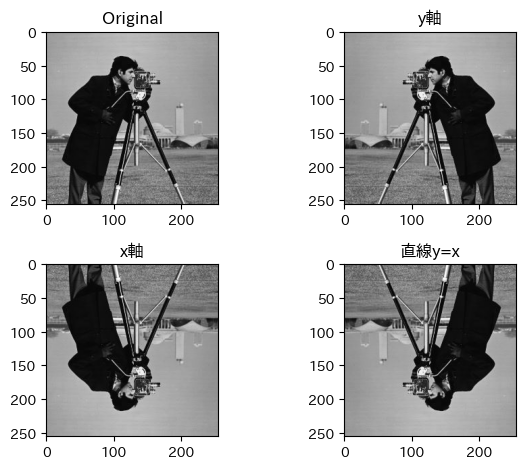
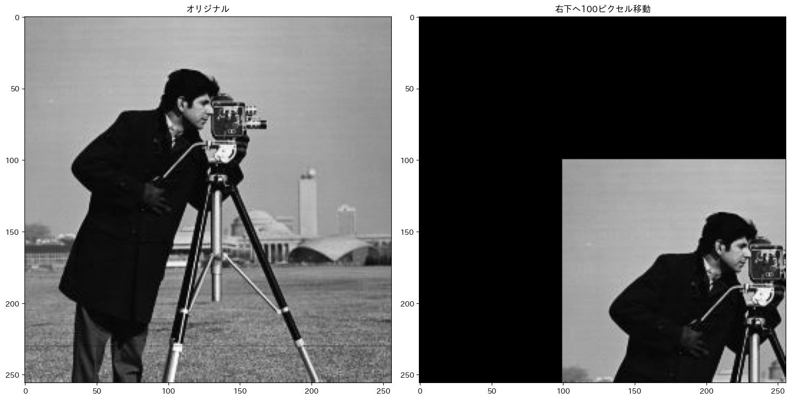
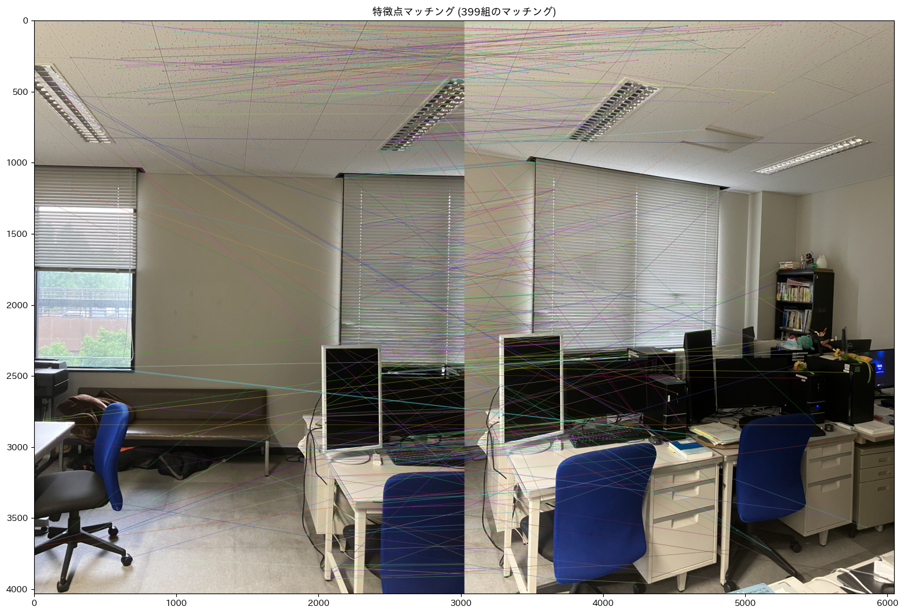

<!-- paginate: true -->
# 知的画像処理特論：幾何学的変換
2025/6/9
棟近春樹

---
# 8-1 線形変換の一般形
下の式で表されるような$(x,y)$から$(x',y')$への変換を線形変換
$$
\begin{pmatrix}
x' \\
y'
\end{pmatrix}
=
\begin{pmatrix}
a & b \\
c & d
\end{pmatrix}
\begin{pmatrix}
x \\
y
\end{pmatrix}
$$
a,b,c,d:任意の実数
&nbsp; 
画像の変換：画像の各画素位置に線形変換を施す

ex.拡大縮小,回転,鏡映、スキュー、合成変換

---
# 8-1-1 拡大・縮小
$$
\begin{pmatrix}
x' \\
y'
\end{pmatrix}
=
\begin{pmatrix}
s_x & 0 \\
0 & s_y
\end{pmatrix}
\begin{pmatrix}
x \\
y
\end{pmatrix}
$$

$s_x,s_y$: x,y方向での拡大(縮小)率

Original(256×256)

縮小された　100×100

---
# 8-1-2 回転
原点を中心に、反時計回りに角度$\theta$だけ回転する変換
$$
\begin{pmatrix}
x' \\
y'
\end{pmatrix}
=
\begin{pmatrix}
\cos\theta & -\sin\theta \\
\sin\theta & \cos\theta
\end{pmatrix}
\begin{pmatrix}
x \\
y
\end{pmatrix}
$$

Original(256×256)

中心から45度回転

---
# 8-1-3 鏡映

ある直線に対し、対称な位置に反転する変換

x軸に関して鏡映
$$
\begin{pmatrix}
x' \\ y'
\end{pmatrix}
=
\begin{pmatrix}
1 & 0 \\
0 & -1
\end{pmatrix}
\begin{pmatrix}
x \\ y
\end{pmatrix}
$$
y軸に関して鏡映
$$
\begin{pmatrix}
x' \\ y'
\end{pmatrix}
=
\begin{pmatrix}
-1 & 0 \\
0 & 1
\end{pmatrix}
\begin{pmatrix}
x \\ y
\end{pmatrix}
$$
x=y直線に関して鏡映
$$
\begin{pmatrix}
x' \\ y'
\end{pmatrix}
=
\begin{pmatrix}
0 & 1 \\
1 & 0
\end{pmatrix}
\begin{pmatrix}
x \\ y
\end{pmatrix}
$$

---
例.

---
# 8-1-4 スキュー
長方形を傾け、平行四辺形にするような変換

x軸方向へのスキュー
$$
\begin{pmatrix}
x' \\ y'
\end{pmatrix}
=
\begin{pmatrix}
1 & b \\
0 & 1
\end{pmatrix}
\begin{pmatrix}
x \\ y
\end{pmatrix}
$$

$b=\tan\theta$

y軸方向へのスキュー
$$
\begin{pmatrix}
x' \\ y'
\end{pmatrix}
=
\begin{pmatrix}
1 & 0 \\
c & 1
\end{pmatrix}
\begin{pmatrix}
x \\ y
\end{pmatrix}
$$
$c=\tan\theta$

---
# 8-1-6 合成変換
ここまでの各種変換：$\mathbf{x'}=\begin{pmatrix}x'\\y'\end{pmatrix}, \mathbf{x}=\begin{pmatrix}x\\y\end{pmatrix}, A=\begin{pmatrix}a & b \\ c & d\end{pmatrix}
$として、
$$
\mathbf{x'}=A\mathbf{x}
$$
と表現できる
&nbsp;

$x\stackrel{A}{\to} x'\stackrel{B}{\to} x''$(矢印の上：変換行列)で線形変換が順次適用される合成変換を考える

$$
x''=Bx'=B(Ax)=(BA)x
$$
行列積BAもまた$2\times2$行列なので、合成変換もまた線形変換となる

---
# 8-2-1 平行移動
x,y方向にそれぞれ$t_x,t_y$だけの平行移動は下式で表せる
$$
\begin{pmatrix}
x' \\ y'
\end{pmatrix}
=
\begin{pmatrix}
x \\ y
\end{pmatrix}
+
\begin{pmatrix}
t_x \\ t_y
\end{pmatrix}
$$

(右下へ100pixel平行移動)
和の計算であるため、平行移動を含む合成変換は行列の積で表せない
   　　　　$\to$同次座標を導入

---
# 8-2-2 同次座標
座標$(x,y)$に対す同次座標$を(\xi_1,\xi_2,\xi_3)$で表す
$$
x=\frac{\xi_1}{\xi_3} ,y=\frac{\xi_2}{\xi_3}
$$
ex.$(x,y)$に対し、$(x,y,1)$、$(\lambda x,\lambda y ,\lambda)$同次座標としてある

&nbsp;
同次座標の同値関係：$(\xi_1,\xi_2,\xi_3)$と$(\lambda\xi_1,\lambda\xi_2,\lambda\xi_3)$のように、通常の座標に直すと同じ点を表す関係
$$
\begin{pmatrix}
\xi_1 \\ \xi_2 \\ \xi_3
\end{pmatrix}
	\textasciitilde
\begin{pmatrix}
\lambda\xi_1 \\ \lambda\xi_2 \\ \lambda\xi_3
\end{pmatrix}
$$
上式は$\mathbf{\tilde{\xi}}\textasciitilde\lambda\mathbf{\tilde{\xi}}$とも書ける

---
# 8-2-3 Affine変換
同次座標を利用した変換の表現　
平行移動　　　　　　　　線形変換　　　　　　　　　　　 Def.Affine変換
$$
\begin{pmatrix}x' \\ y' \\ 1\end{pmatrix}
\textasciitilde
\begin{pmatrix}
1 & 0 & t_x \\
0 & 1 & t_y \\
0 & 0 & 1
\end{pmatrix}
\begin{pmatrix}x \\ y \\ 1\end{pmatrix}
\hspace{3em}
\begin{pmatrix}x' \\ y' \\ 1\end{pmatrix}
\textasciitilde
\begin{pmatrix}
a & b & 0 \\
c & d & 0 \\
0 & 0 & 1
\end{pmatrix}
\begin{pmatrix}x \\ y \\ 1\end{pmatrix}
\hspace{3em}
\begin{pmatrix}x' \\ y' \\ 1\end{pmatrix}
\textasciitilde  
\begin{pmatrix}
a & b & t_x \\
c & d & t_y \\
0 & 0 & 1
\end{pmatrix}
\begin{pmatrix}x \\ y \\ 1\end{pmatrix}
$$
Affine変換：平行移動と線形変換を組み合わせた変換
ex.平行移動,線形変換：縮小、回転

---
# Euclid変換、相似変換
Affine変換の特殊な例 変換行列のみ示す

- Euclid変換：回転と平行移動の組み合わせ
$$
\begin{pmatrix}
\cos\theta & -\sin\theta & t_x \\
\sin\theta & \cos\theta & t_y \\
0 & 0 & 1 
\end{pmatrix}
$$
- 相似変換：ユークリッド変換に縦横の倍率が等しい拡大縮小を追加
$$
\begin{pmatrix}
s\cos\theta & -s\sin\theta & t_x \\
s\sin\theta & s\cos\theta & t_y \\
0 & 0 & 1 
\end{pmatrix}
$$

---
# 8-2-4 射影変換
射影変換：Affine変換の一般化　
$$
\begin{pmatrix}x' \\ y' \\ 1\end{pmatrix}
\textasciitilde  
\begin{pmatrix}
h_{11} & h_{12} & h_{13} \\
h_{21} & h_{22} & h_{23} \\
h_{31} & h_{32} & h_{33} \\
\end{pmatrix}
\begin{pmatrix}x \\ y \\ 1\end{pmatrix}
$$
(ベクトル表現で$\mathrm{\tilde{x}'}\textasciitilde H\mathrm{\tilde{x}}$)
同次座標であることから、実際の処理は下式
$$
x'=\frac{h_{11}x+h_{12}y+h_{13}}{h_{31}x+h_{32}y+h_{33}},\quad
y'=\frac{h_{21}x+h_{22}y+h_{23}}{h_{31}x+h_{32}y+h_{33}}
$$

---
射影変換の例

線分の直交性は保たれるが、平行性が失われる

任意の四角形を別の任意の四角形に移す変換

---

---
# 8-2-5 合成変換
線形変換と同様、同次座標を利用した射影変換でも合成変換の性質は成り立つ
$$
\tilde{x}\stackrel{H_1}{\to} \tilde{x}'\stackrel{H_2}{\to} \tilde{x}''
$$
(変換$H_1,H_2$が順々に適用されるとする)
すると、

$$
\tilde{x}''\textasciitilde H_2\tilde{x}'\textasciitilde H_2(H_1\tilde{x}) \textasciitilde (H_2H_1)\tilde{x}
$$
つまり、$H_2H_1$が2つの変換を合成した変換となる

---
# 8-3-1 画像の再標本化
- 再標本化：変換時に生じる画素位置と標本化位置のずれの補正
   1. 変換後の出力画像の各画素位置$(x',y')$に対し、逆変換を行い、元の画像の画素位置$(x,y)$を求める
   1. 補間を行い、$(x,y)$に対応する入力画像の画素値を求める

紹介する補間：ニアレストネイバー、バイリニア補間、バイキュービック補間

---
# 8-3-2 ニアレストネイバー

&nbsp;

$$
I(x,y)=f([x+0.5],[y+0.5])
$$

(x,y):値を求めたい位置
I(x,y):(x,y)の画素値
f(i,j):入力画像の画素値
[]:Gauss記号(小数点以下切り捨て)

求めたい位置に最も近い画素位置の値をそのまま利用

---
# 8-3-3 バイリニア補間
まわりの4画素の値を利用する補間
$$
I(x,y)=
\begin{pmatrix}
([x]+1-x & x-[x])
\end{pmatrix}
\begin{pmatrix}
f([x],[y]) & f([x],[y]+1) \\
f([x]+1,[y]) & f([x]+1,[y]+1)
\end{pmatrix}
\begin{pmatrix}
[y]+1-y \\
y-[y]
\end{pmatrix}
$$

---
# 8-3-4 バイキュービック補間
まわりの16画素の値を利用する補間
$$
I(x,y)=
\begin{pmatrix}
(h(x_1) & h(x_2) & h(x_3) & h(x_4))
\end{pmatrix}
\begin{pmatrix}
f_{11} & f_{12} & f_{13} & f_{14} \\
f_{21} & f_{22} & f_{23} & f_{24} \\
f_{31} & f_{32} & f_{33} & f_{34} \\
f_{41} & f_{42} & f_{43} & f_{44}
\end{pmatrix}
\begin{pmatrix}
h(y_1) \\
h(y_2) \\
h(y_3) \\
h(y_4)
\end{pmatrix}
$$ 
---

変数$f_{ij}、x_i,y_i$の定義

h(t):sinc関数を3次多項式で近似したもの
&nbsp;
$$
\text{sinc}(t)=\sin(\pi t)/\pi t
$$
&nbsp;
$$
h(t)=
\begin{cases}
\|t\|^3-2\|t\|^2+1 & \text{if } \|t\|\leq 1 \\
-\|t\|^3+5\|t\|^2-8\|t\|+4 & \text{if } 1 < \|t\|\leq 2 \\
0 & \text{if } \|t\| > 2
\end{cases}
$$

---
画像を拡大したときの各補間の比較

補間された画像を拡大して見てみる

---

バイリニア：ニアレストネイバーのようなジャギーが目立たなくなる一方、エッジがなまる
バイキュービック：バイリニアと比べて、よりシャープに

---
# 8-4-1 イメージモザイキングとその概略処理手順
イメージモザイキング：複数の画像を合成して1枚の大きな画像を作成する技術
ex.視点の異なる複数枚の画像を合成し広い範囲の画像を得る

処理概略
1. 特徴点の検出とマッチング
1. 幾何学的変換の推定
1. 画像の幾何学的変換と合成

2枚の画像をつなぎ合わせるイメージモザイキング処理で各ステップごとに説明する

---
# 8-4-2 特徴点の抽出とマッチング
マッチング：画像間の対応点を見つける処理
マッチングを行い画像間の対応を見つけた結果

---
# 8-4-3 幾何学的変換の推定
画像間は射影変換によって結合する
def.射影変換の式
$$
x'=\frac{h_{11}x+h_{12}y+h_{13}}{h_{31}x+h_{32}y+h_{33}},\quad
y'=\frac{h_{21}x+h_{22}y+h_{23}}{h_{31}x+h_{32}y+h_{33}}
$$
$h_{33}=1$とし、変形
$$
\begin{align}
xh_{11}+yh_{12}+h_{13}-xx'h_{31}-x'yh_{ew}=x' \\
xh_{21}+yh_{22}+h_{23}-xx'h_{32}-x'yh_{ew}=y'
\end{align}
$$
マッチングでえられた対応する特徴点の座標$(x,y)(x',y')$が少なくとも４組あれば、連立方程式として解ける

---
各対応点から得られる式を並べると行列表現ができる
$$Ah=b$$
この式の最小二乗解、すなわち
$$
E=\frac{1}{2}(Ah-b)^T(Ah-b)\to \min
$$
となるようなhは、一般化逆行列解
$$
h=(A^TA)^{-1}A^Tb
$$
として得られる

---
# アウトライヤの除去
アウトライヤ：マッチングの結果による誤った対応点
- RANSAC：アウトライヤを考慮した変換のパラメータ推定手法
    1. ランダムに4組の特徴点の対応を選択
    1. 射影変換Hを推定
    1. Hから正しく変換された対応点(インライア)の数を確認
    1. 上の操作を繰り返す
    1. インライアが最も多いパラメータが採択

---

---

結合結果

---
# 8-4-4 画像の幾何学的変換と合成
画像のつなぎ目を目立たなくさせるには、重み付き平均を計算

&nbsp;

重なった領域の画素値の計算方法
$$
\frac{d_1 I_1+d_2 I_2}{d_1+d_2}
$$
($d_1,d_2$:画像1,2からの距離 $I_1,I_2$:画像1,2の画素値)

---

---
# 8-4-5 平面パノラマ、円筒面パノラマ、球面パノラマ
射影変換で２つの画像をつなぎ合わせることで、平面パノラマの生成に成功した
これが機能する条件として
- 撮影対象が平面
- カメラが光学中心を回転中心として回転し、撮影されていること

が必要。　平面パノラマ以外にも円筒パノラマ、球面パノラマがある

